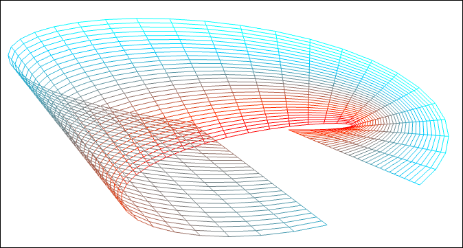
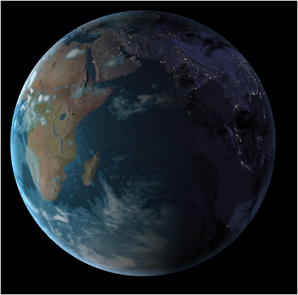
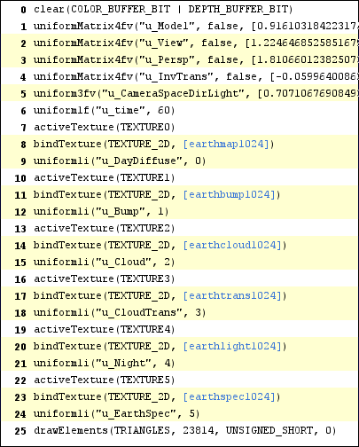
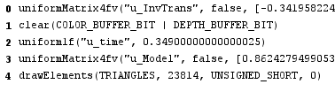

CIS 565 Project 5: WebGL
========================

* Kai Ninomiya (Arch Linux, Intel i5-2410M)
  (Performance numbers taken on i5-4xxx/GTX 750)

**[Live demo](https://kainino0x.github.io/Project5-WebGL/)**

**[Demo video](http://youtu.be/yTLYuimgv24)**

Part 1
------

Given code:

* Drawing a VBO through WebGL
* Javascript code for interfacing with WebGL
* Functions for generating simplex noise

Implemented:

* Sine-wave-based vertex shader
* A parametric surface (mobius band) vertex shader
  * Interprets input (x, y) position as (s, t) of a parametric surface and
    moves the vertices to the (x, y, z) calculated parametrically from (s, t).

Part 2
------

Given code:

* Reading and loading textures
* Rendering a sphere with textures mapped on
* Basic passthrough fragment and vertex shaders 
* A basic globe with Earth terrain color mapping
* Gamma correcting textures
* Javascript to interact with the mouse
  * Left-click and drag moves the camera around
  * Right-click and drag moves the camera in and out

Implemented:

* Bump mapped terrain (using a height-map input)
* Rim lighting to simulate atmospheric scattering (on lit parts of the globe)
* Night-time lights on the dark side of the globe (smoothly blended)
* Specular mapping (showing specularity on the water)
* Moving clouds (using a cloud layer)
* Procedural water rendering and animation using noise
  * Noise library (c) Ashima Arts. Used under MIT License. [1]

### Performance

I found that I was unable to capture any meaningful data using Stats.js [2]
rendering time of each frame, due to lack of granularity (it always showed 0 or
1 ms per frame). However, using the `performance` API, I was able to make some
measurements. Additionally, using Ben Vanik's WebGL Inspector, I was able to
find and make a few optimizations.

* Factored out the first two rotations of the model matrix calculation
* Only set the earth texture uniforms once
* Only compute the light position and camera matrices when the camera is moved

| Stage                          | Total rendering time over 300 frames |
|:------------------------------ | ------------------------------------:|
| Before optimization            |                             ~18.5 ms |
| Factored out model matrix calc |                             ~16.5 ms |
| Fewer texture uniform sets     |                             ~15.5 ms |
| Fewer uniform uploads          |                             ~14.5 ms |

Before optimization:

After optimization:

References/Libraries
--------------------

[1] webgl-noise. Copyright 2011 Ashima Arts. Used under MIT License.
    https://github.com/ashima/webgl-noise

[2] stats.js. Copyright 2009-2012 Mr.doob. Used under MIT License.
    https://github.com/mrdoob/stats.js
